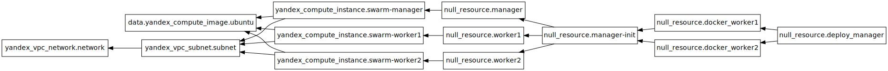
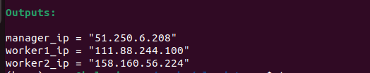
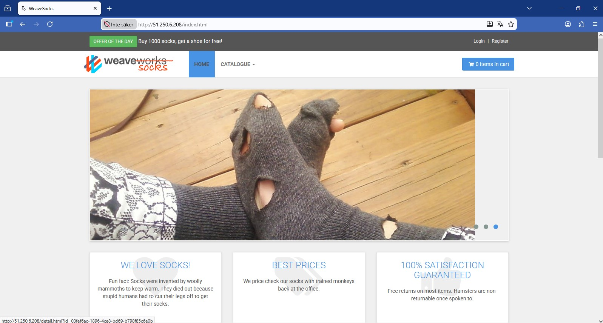
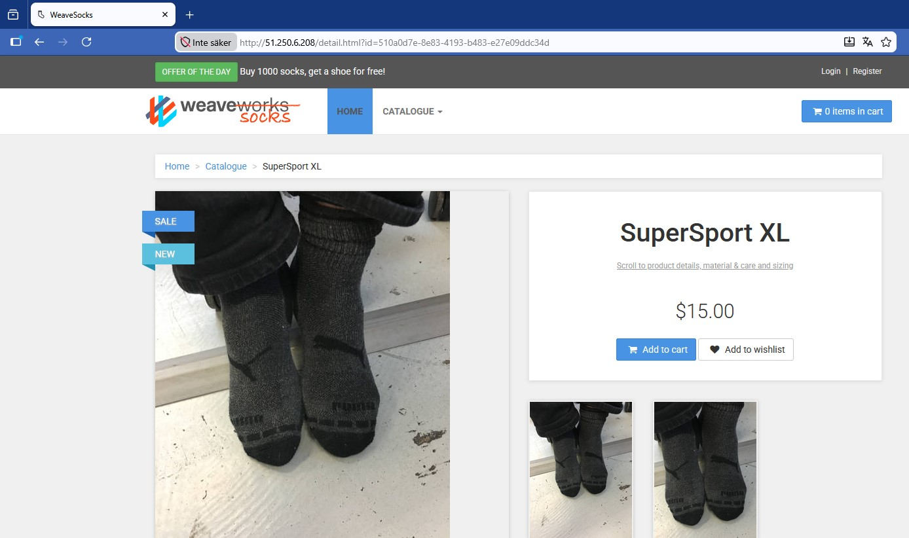
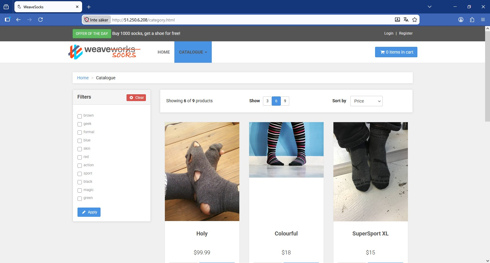

<h1>Разворачиваем носки с помощью terraform и docker swarm</h1>
<i>чувствительные данные (токены яндекс облака, путь к ssh) указываются через <b>terraform.tfvars</b>,<br>
<br>Пример файла:
```
 token                = "y*****"
folder_id            = "b******o"
service              = "a******9"
ssh_private_key_path = "~/.ssh/*****"
```

</i>
<p> основная конфигурация расположена в ya.tf. </p>
<p><b>Как выглядят зависимости ресурсов</b></p>


<br>
<p> После разворачивания ВМ установка docker, иницииация docker-swarm происходит через null_resource </p>
<p> ВМ присоились эти ip</p>

<h2>ВМ1:</h2>
<p>файл docker-compose.yml находится на локальном компьютере. После установки докера null-resource.manager-init через local-exec инициирует docker swarm и сохраняет результат на локальный компьютер, чтобы нужные данные не потерялись в том случае, если с ВМ 1 что-то случиться</p>
<h2>ВМ2, 3</h2>
<p>Такая же установка докера. После получения результата с локального компа для join локальный же файл передается на обе машины и выполняется как скрипт</p>
<h3>Деплой носков:</h3>
<p>После того, как ВМ 2,3 присоединились к кластеру разворачиваем сайт  </p>
Cкрин 1
<br>
Скрин 2
<br>
Скрин 3
<br><br>
<h2>Проверка что все развернулось</h2>

<h1>THE END</h1>
